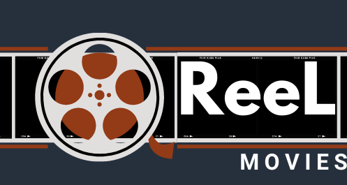

<!-- PROJECT LOGO -->
<br />
<p align="left">
  <a href="https://github.com/github_username/repo_name">
    
  </a>

  <h3 align="left">Reel Movies Database</h3>

  <p align="left">
    A fullstack web application modeled similarly to the Internet Movie Database. 
    <br />
  </p>
</p>


<!-- TABLE OF CONTENTS -->
<details open="open">
  <summary><h2 style="display: inline-block">Table of Contents</h2></summary>
  <ol>
    <li>
      <a href="#about-the-project">About The Project</a>
      <ul>
        <li><a href="#built-with">Built With</a></li>
      </ul>
    </li>
    <li>
      <a href="#getting-started">Getting Started</a>
      <ul>
        <li><a href="#prerequisites">Prerequisites</a></li>
        <li><a href="#installation">Installation</a></li>
      </ul>
    </li>
    <li><a href="#contributing">Contributing</a></li>
  </ol>
</details>


<!-- ABOUT THE PROJECT -->
## About The Project

### Feautures:
* Supports Logins : authenticated log-in 
  *  Regular Users
        * able to browse information across the application, add reviews, and follow people.
  *  Contributing Users
        * able to do all regular user attibute plus adding new people (actors, directors, e.g.), new movies, and edit pre-existing data.
* Viewing Movie Information
  *  Movies and their specific information (title, release year, writers, actors, etc.)
  *  Writers, Actors, and Directors profile and see a history of movies they partake in
* Search for Movies


### Built With
  * [React.JS](https://reactjs.org/)
  * [TailwindCSS](https://tailwindcss.com/)
  * [Node.JS](https://nodejs.org/en/)
  * [MongoDB](https://www.mongodb.com/)

  
<!-- GETTING STARTED -->
## Getting Started
### Prerequisites

* [Node Version 14](https://nodejs.org/dist/v14.15.5/node-v14.15.5-x64.msi)
* Database Setup : [init-db.js](https://github.com/gelicamarie/ReelMovies/blob/main/backend/src/init-db.js)
  * Run mongoDB and onto the project: 
    ```sh
    cd backend
    npm run db
    ```
  * Uncomment and run these lines in order to populate the database (wait for each to finish before running the next line)
    ```sh
    168: moviesCollection(includeInMovies);
    ```
     ```sh
    169:  personCollection(people);
    ```
       ```sh
    170:  relateMovieToPersons('actors', 'actor');
    ```
     ```sh
    171: relateMovieToPersons('directors', 'director');
    ```
       ```sh
    172:  relateMovieToPersons('writers', 'writer');
    ```
    
    * Once this is finished, comment out lines 51-53 and uncomment 54-56 in the [model.js](https://github.com/gelicamarie/ReelMovies/blob/main/backend/src/models/movie.js) 
    ```sh
      51: // directors: [String],
      52: // actors: [String],
      53: // writers: [String],
      54: directors: [ObjectReference('Person')],
      55: actors: [ObjectReference('Person')],
      56: writers: [ObjectReference('Person')],
    ```
    
    Continue Running these three lines in [init-db.js](https://github.com/gelicamarie/ReelMovies/blob/main/backend/src/init-db.js), one by one
     ```sh
    173:  updateObjectId('actors');
    ```
     ```sh
    174: updateObjectId('directors');
    ```
    ```sh
    175:  updateObjectId('writers');
    ```
    
### 🛠 Installation & Set Up

1. Clone the repo
   ```sh
   git clone https://github.com/gelicamarie/ReelMovies.git
   ```
2. Install dependencies
   ```sh
   npm install
   ```
3. Start the dev server
   ```sh
   npm start
   ```


<!-- CONTRIBUTING -->
## Contributing

Contributions are what make the open source community such an amazing place to be learn, inspire, and create. Any contributions you make are **greatly appreciated**.

1. Fork the Project
2. Create your Feature Branch (`git checkout -b feature/AmazingFeature`)
3. Commit your Changes (`git commit -m 'Add some AmazingFeature'`)
4. Push to the Branch (`git push origin feature/AmazingFeature`)
5. Open a Pull Request


